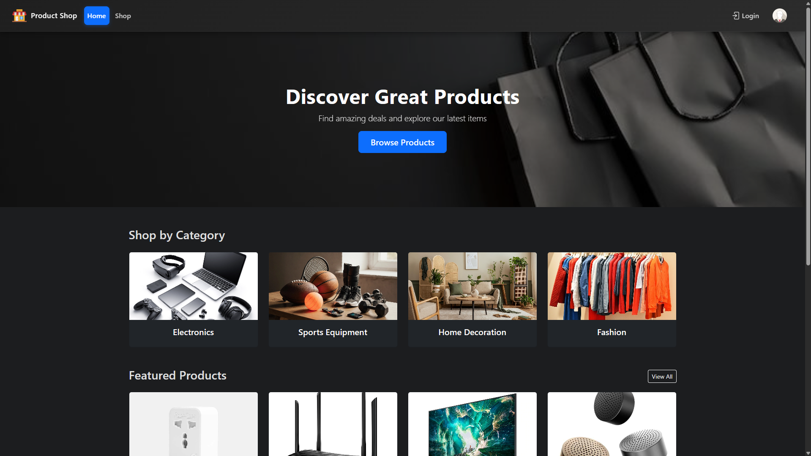
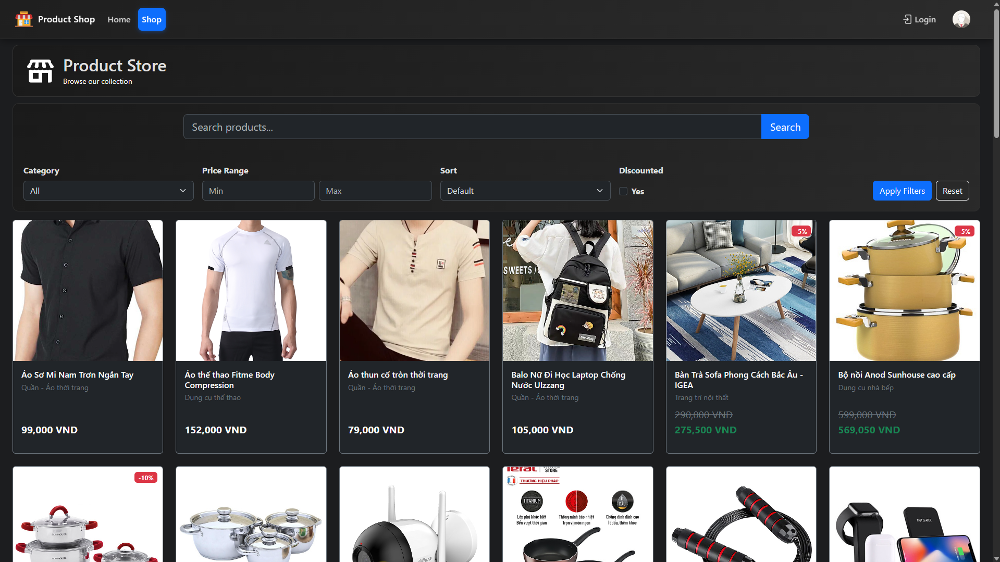
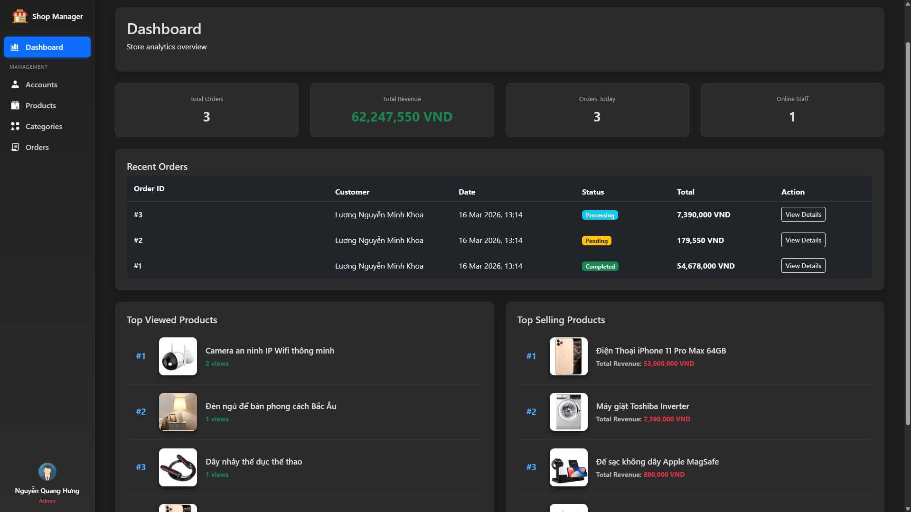
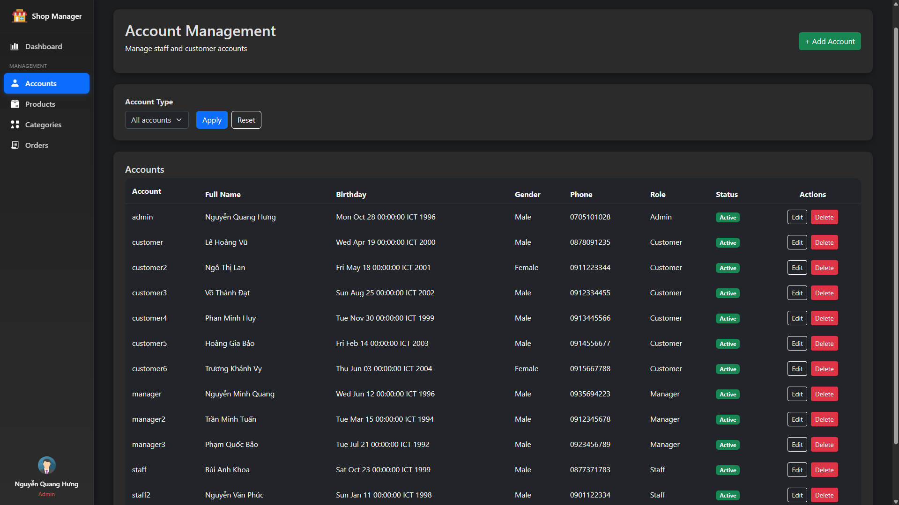

# 🛒 Online Shop Management System

A **Java web application** that simulates a small online shop platform with customer browsing features and an administrative management panel.

This project was developed to practice **Java web development using Servlets, JSP, and the MVC architecture pattern**.

---

## 📌 Overview

This system supports two types of users: **customers** and **administrators**.

### Customers can:
- Browse products
- View product details
- Filter products by category
- Sort products by price
- View discounted items

### Administrators can:
- Manage products
- Manage categories
- Manage user accounts
- Activate / deactivate accounts
- Monitor and manage orders

The application follows the **Model – View – Controller (MVC)** design pattern implemented using **Java Servlets and JSP**.

---

## ✨ Features

### Customer Features

- Browse product catalog
- View product details
- Filter products by category
- Sort products by price
- View discounted items

### Admin Features

- Product management (add, edit, delete)
- Category management
- Account management
- Activate / deactivate user accounts
- Product filtering and sorting
- Order management

---

## 🛠 Tech Stack

### Backend
- Java Servlet
- JSP (JavaServer Pages)
- JSTL

### Frontend
- HTML
- CSS
- Bootstrap

### Database
- MySQL

### Server
- Apache Tomcat

### Architecture
- MVC (Model – View – Controller)

---

## 📂 Project Structure


```
src/
 ├───controllers/        # Servlets (Controller layer)
 ├───exceptions/         # Custom exceptions
 ├───filters/            # Authentication / encoding Filters
 ├───listeners/          # Context and session listeners
 ├───models/
 │   ├───entities        # Entity classes
 │   └───services        # Service classes (Database communication)
 └───utilities/          # Utility classes

web
 ├───admin/              
 │   ├───account        # Account managment JSPs
 │   ├───category       # Category managment JSPs
 │   ├───order          # Order managment JSPs
 │   └───product        # Product managment JSPs
 ├───css/               # Stylesheets
 ├───images/           
 │   ├───icons          
 │   ├───preview
 │   └───sanPham        # Product images
 ├───META-INF
 ├───user/              # Customer facing JSPs
 └───WEB-INF

ProductIntroDB.sql        # Database initialization script
```

---

## 🗄 Database Setup

Run the SQL script to create the database schema and sample data.

```
ProductIntroDB.sql
```

This script will:

- Create all required tables
- Insert initial sample data

---

## 🚀 Running the Project

### Requirements

- JDK 8+
- Apache Tomcat 9.x
- MySQL Server
- IDE (IntelliJ IDEA / NetBeans / Eclipse)

---

### Installation Steps

1️⃣ Clone the repository

```bash
git clone https://github.com/TommyMoonn/product-shop
```

2️⃣ Import the project into your IDE.

3️⃣ Configure Apache Tomcat as the application server.

4️⃣ Set up the MySQL database connection.

5️⃣ Run the SQL script:

6️⃣ Deploy the project to Tomcat.

7️⃣ Open in your browser:

```
http://localhost:8080/productshop
```

---

## Architecture

The application follows the **MVC pattern**.

```
Client
   ↓
Servlet (Controller)
   ↓
Service / Model (Database interaction)
   ↓
JSP (View)
```

* **Controller**: Servlets handle requests and business logic.
* **Model**: Service and Entity classes manage data.
* **View**: JSP pages render the UI.

### Layer Responsibilities

#### Controller
- Handles HTTP requests
- Processes user input
- Calls service layer

#### Model
- Entity classes represent data
- Services handle database operations

#### View
- JSP pages render UI
- JSTL used for dynamic content

---

## Admin Panel

The admin panel allows management of:

* Products
* Categories
* Accounts
* Orders

Example paths:

```
/admin/product
/admin/category
/admin/account
/admin/orders
```

Access is restricted based on user roles.

---

## Screenshots 

### Home page


### Product store


### Admin dashboard



### Account management page


---

## Notes
This project was developed for learning purposes to practice:
* Java web development
* Servlet & JSP architecture
* MVC design pattern
* Database integration with MySQL
* Admin dashboard implementation
* Authentication & role-based access

## 👤 Author

### Khoa Luong

GitHub:
https://github.com/TommyMoonn